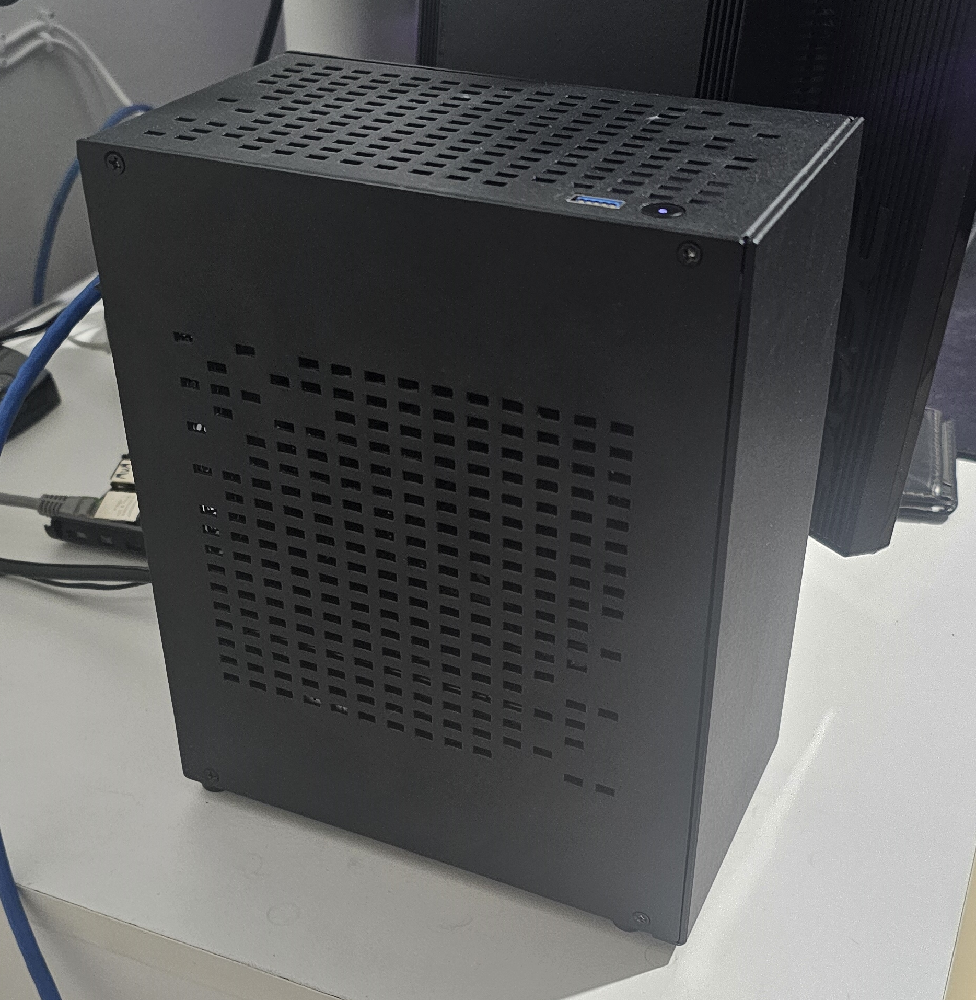

# My Homelab Setup
Homelab stacks, templates, and more fun resources! This is a *work in progress*. I still have a ton to update and add.

## Navigation
* [Apps](/apps/README.md) - List of all the apps and services.
* [Dashboard](/dashboard/README.md) - Dashboards and monitoring tools.
* [Network](/network/README.md) - Network scripts and Cloudflare setup.
* [Home Assistant](/homeassistant/README.md) - Smart home services and automation.
* [Server Monitoring](/monitoring/README.md) - Server Monitoring services.

## Hardware

### Servers
#### Intel Desktop (Proxmox)
This machine is running my Proxmox Server. Handling our media storage, arr services, proxy, home assistnat, monitoring, and many others. (not all true but will update)
* 8 x Intel(R) Core(TM) i7-4790K CPU @ 4.00GHz
* 16GB Corsair DDR3
* 128GB SSD (Boot Drive)
* 960GB SSD (Flash)

#### Raspberry Pi4 ModelB (DietPi)
This machine is running DietPi. Responsible for all network work: cloudflare tunnel, network scripts and glance dashboard.
* Quad core Cortex-A72 (ARM v8) 64-bit SoC @ 1.8GHz
* 4G LPDDR4-3200 SDRAM
* 64GB Micro-SD
