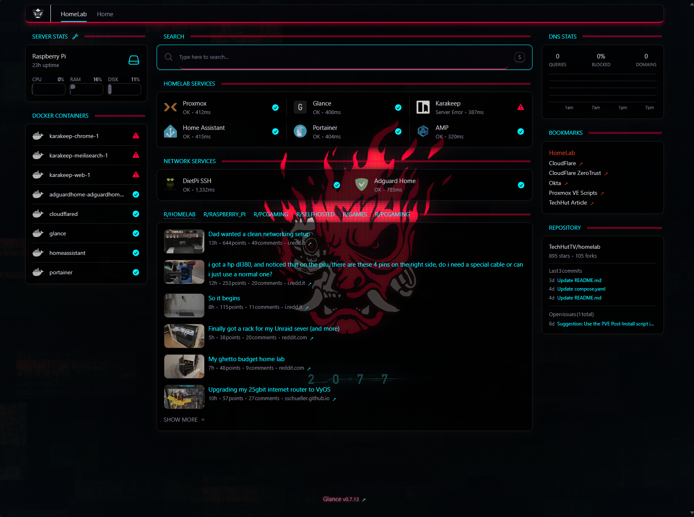
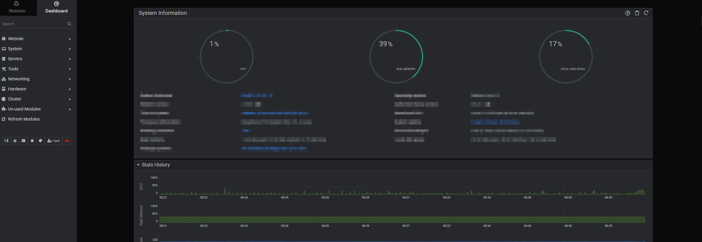
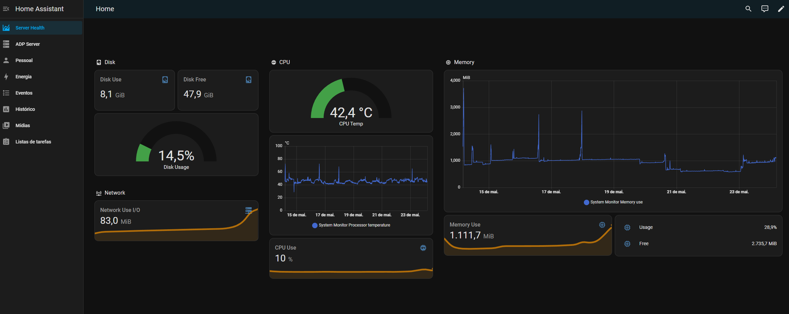
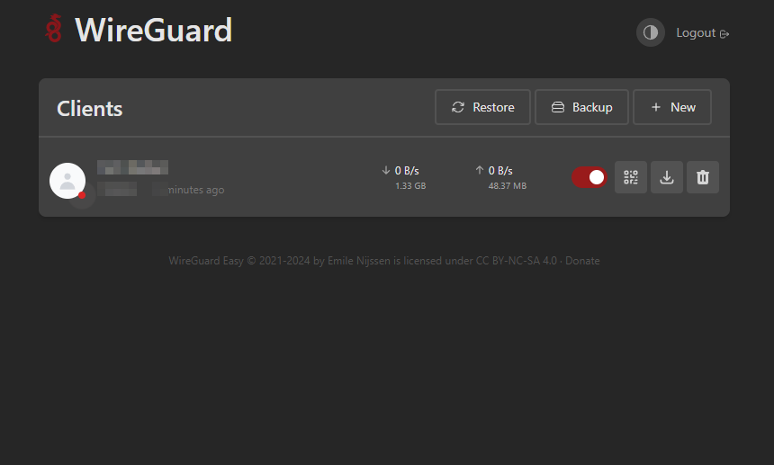

**This is a work in progress.**

# Homelab

This page in the homelab repository is a way to feature all of the apps that I have running! While the purpose of the directory is to give a home of all the apps that don't need their own guides and resources, it will still feature everything I run on my machines. Formatting of the readme inspired by [awesome-selfhosted](https://github.com/awesome-selfhosted/awesome-selfhosted).

## Navigation
* [__Apps__](/apps/README.md) - List of all the apps and services.
* [Dashboard](/dashboard/README.md) - Dashboards and monitoring tools.
* [Network](/network/README.md) - Network scripts and Cloudflare setup.
* [Home Assistant](/homeassistant/README.md) - Smart home services and automation.

In my network I also have a Raspberry Pi responsible for all network work: cloudflare tunnel, network scripts and glance dashboard.

## Dashboards

Dashboard are used to create a simple webpage with links to all the services, websites, or really anything you care about. What makes each dashboard special and unique is the features they come with. Many can act as monitoring tools, have widgets to get more details from services, weather, and more.

### Glance

<!--  -->

**TechHutTV statement**:

"This dashboard is a new addition for me, it’s not the most feature rich of the options out there, but for me it’s simplistic and default look and feel is what stands out to me. You can use it to monitor and link to all your applications, like most tools in this category, but it also is great for monitoring various feeds, websites, and a customizable RSS feed. I use the tool as a start page for my web browser and it gives a quick and simple _glance_ of everything that I care about. One of the best things about it, in my opinion, is that everything is customized and configured in a simple yaml file."

For me is a lightweight but complete dashboard that serves my purpouses.

## Server Monitoring

### Webmin

<!--  -->

Webmin server monitoring for my raspberry pi 4, great ui with endless features.

## Smart Home and Automation

### Home Assistant

<!--  -->

Home Assistant is a great tool that allows the connection of many devices in your smart home and integrate them together with a variety blueprints, automatons, and more. You can create custom dashboards, use their mobile app, and so much more I can’t even properly describe here how much this tool is capable of.

## DNS and Remote Connections

### Adguard

<!--  -->

My choice DNS server, a Domain Name Service that blocks certain DNS inquiries. It uses filter rules and blacklists of domains associated with advertisements and tracking.

### NGINX Proxy Manager

<!--  -->

NGINX Proxy Manager is a simple web based proxy manager for setting up and forwarding domain names to your services and generating SSL certifications. I use this for local top level domains.

### Cloudflare Tunnel and Scripts

This is a simple solution I found to expose my services to the internet. Using Cloudflare Tunnel is much simpler than setting up a proxy and creating certificates. If you have static IPs on your server, it’s even better. In my case, I found a workaround by creating scripts and using DDNS that update my custom DNS records and policies with my public IP. 

Why i need this?
I need to use this becuase my public IP is dynamic, meaning it will randomly and automatically change every few weeks or sometimes every few days.

### Wireguard

<!--  -->

Self-hosted VPN to have remote access to my local services.