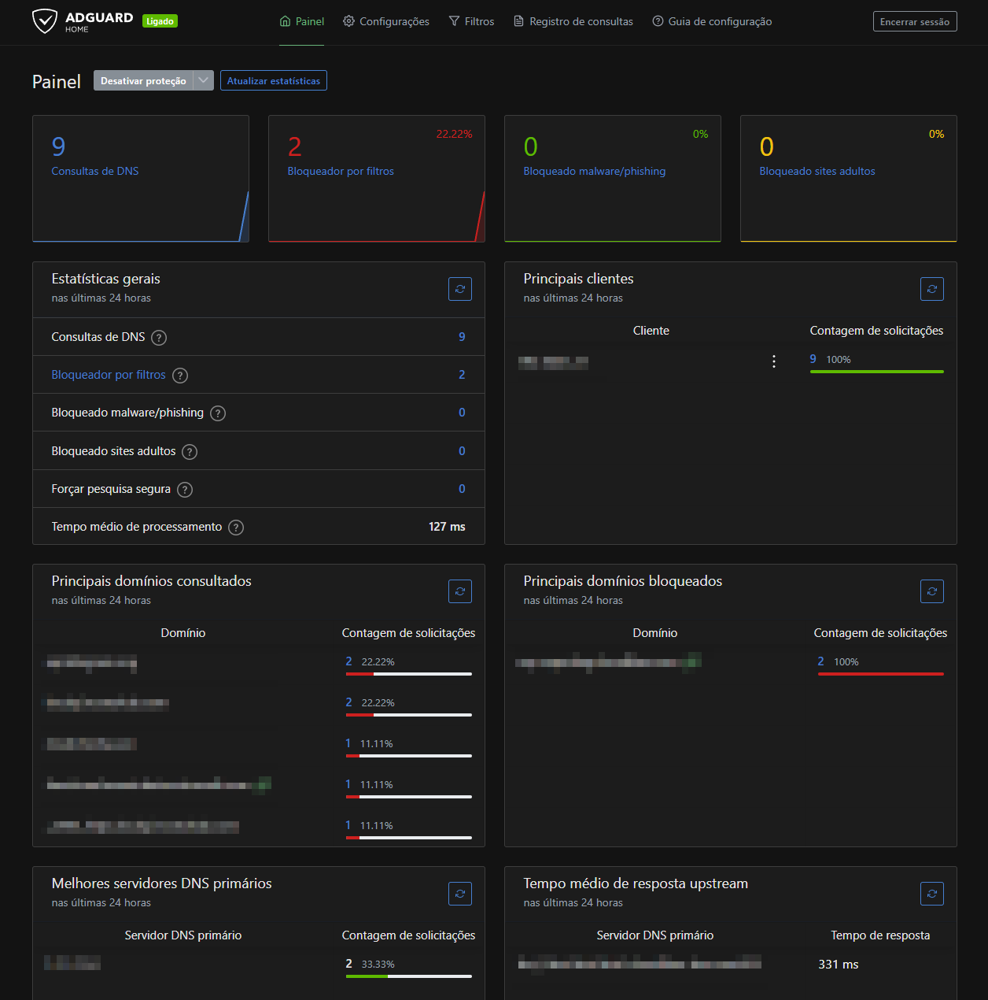

# **Adguard Home**

Creates a DNS server for your local network to apply filter rules and other features.



## Navigation
* [Apps](/apps/README.md) - List of all the apps and services.
* [Dashboard](/dashboard/README.md) - Dashboards and monitoring tools.
* [Network](/network/README.md) - Network scripts and Cloudflare setup.
  - [Scripts](/network/scripts/README.md) - Scripts for network and cloudflare.
  - [__Adguard Home__](/network/adguardHome/README.md) - Adguard DNS Server.
  - [Wireguard](/network/wireguard/README.md) - Wireguard VPN Server.
* [Home Assistant](/homeassistant/README.md) - Smart home services and automation.


---

# AdGuard Home Setup with Docker Compose

A simple guide to deploy AdGuard Home using Docker Compose, with recommended DNS servers and blocklists.

## Prerequisites
- Docker installed
- Docker Compose installed

## Setup

### 1. Create `docker-compose.yml`
```yaml
version: '3'
services:
  adguardhome:
    image: adguard/adguardhome
    container_name: adguardhome
    restart: unless-stopped
    ports:
      - 53:53/tcp   # DNS (TCP)
      - 53:53/udp   # DNS (UDP)
      - 80:80/tcp   # Web UI (HTTP)
      - 3000:3000/tcp  # Initial setup (optional after config)
    volumes:
      - ./config:/opt/adguardhome/conf  # Config files
      - ./work:/opt/adguardhome/work    # Runtime data
```

### 2. Start AdGuard Home
```bash
docker-compose up -d
```

### 3. Access Web UI
Open `http://<your-server-ip>:3000` in your browser to complete setup.

---

## Recommended Configuration

### DNS Servers (Upstream)
Configure these in **Settings → DNS Settings → Upstream DNS**:
```
9.9.9.9
149.112.112.112
https://dns.quad9.net/dns-query
tls://dns.quad9.net
1.1.1.1
1.0.0.1
https://dns.cloudflare.com/dns-query
tls://1dot1dot1dot1.cloudflare-dns.com
8.8.8.8
```

### DNS Blocklists
Add these under **Filters → DNS Blocklists**:
- [AdGuard DNS filter](https://adguardteam.github.io/AdGuardSDNSFilter/Filters/filter.txt)
- [AWAvenue Ads Rule](https://raw.githubusercontent.com/awavenue/Blocklist/main/rule.txt)
- [1Hosts (Lite)](https://badmojr.gitlab.io/1hosts/Lite/adblock.txt)
- [AdGuard DNS Popup Hosts filter](https://adguardteam.github.io/HostlistsRegistry/assets/filter_14.txt)

---

## Router Configuration
1. **Set Static DNS**:
   - Primary DNS: `<your-server-ip>` (where AdGuard Home runs)
   - Secondary DNS: `1.1.1.1` (Cloudflare, as backup)

2. **Reserve IP**:
   - Assign a static IP to your AdGuard Home machine via DHCP reservation (router settings).
