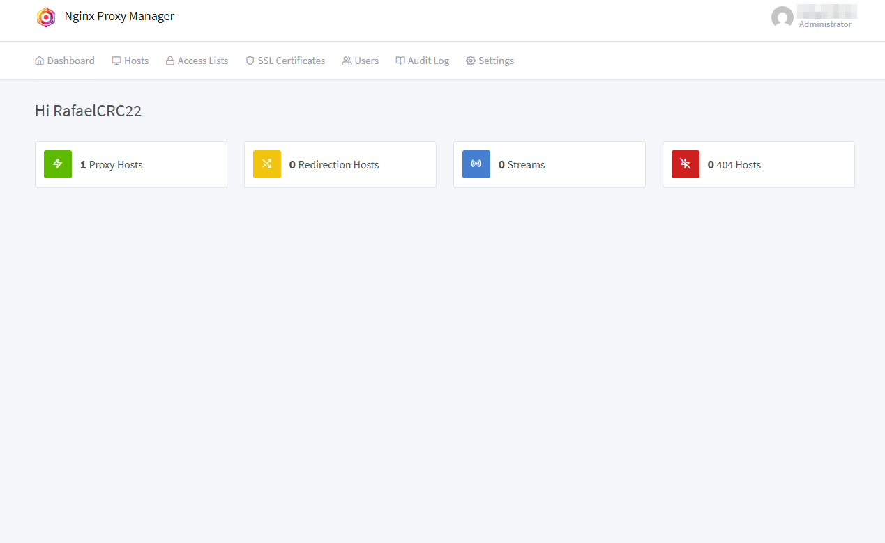
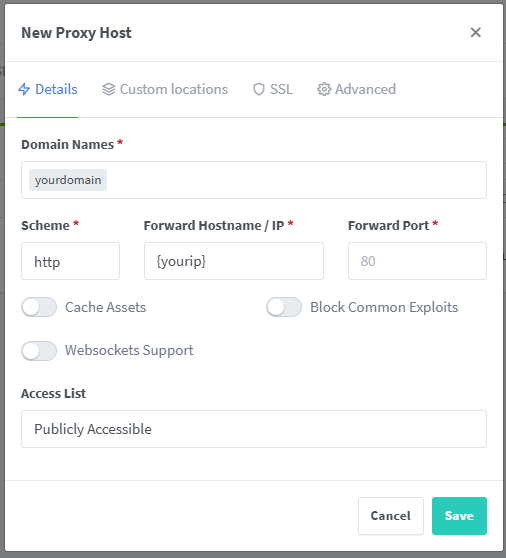
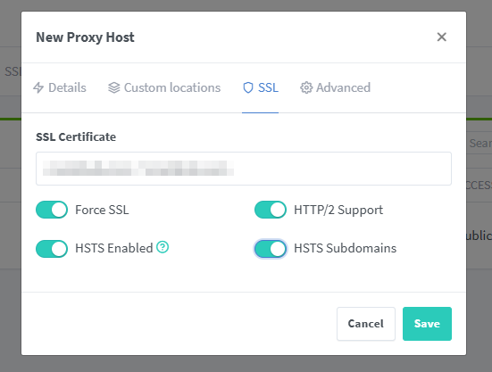

# **Nginx Proxy Manager Setup for Local Domains**  

Create secure local domains (e.g., `guard.yourdomain.com`) to access services like AdGuard Home, using Cloudflare DNS and SSL.



## Navigation
* [Apps](/apps/README.md) - List of all the apps and services.
* [Dashboard](/dashboard/README.md) - Dashboards and monitoring tools.
* [Network](/network/README.md) - Network scripts and Cloudflare setup.
  - [Adguard Home](/network/adguardHome/README.md) - Adguard DNS Server.
  - [DNSS](/network/dnss/README.md) - Container to update Cloudflare records with public ip.
  - [__Nginx Proxy Manager__](/network/nginx/README.md) - Nginx proxy manager.
  - [Scripts](/network/scripts/README.md) - Scripts for network and cloudflare.
  - [Wireguard](/network/wireguard/README.md) - Wireguard VPN Server.
* [Home Assistant](/homeassistant/README.md) - Smart home services and automation.
* [Server Monitoring](/monitoring/README.md) - Server Monitoring services.

---

## **Prerequisites**
1. **Docker & Docker Compose** installed.
2. A **domain** (e.g., `yourdomain.com`) managed by Cloudflare.
3. Cloudflare **API Token** with DNS edit permissions.

---

## **1. Deploy Nginx Proxy Manager**
### **`docker-compose.yml`**
```yaml
version: '3'
services:
  app:
    image: 'jc21/nginx-proxy-manager:latest'
    container_name: nginx-proxy-manager
    restart: unless-stopped
    ports:
      - '82:80'   # Web traffic (use 80:80 if AdGuard isn't running)
      - '81:81'   # Admin UI
      - '443:443' # HTTPS
    volumes:
      - ./data:/data
      - ./letsencrypt:/etc/letsencrypt
    healthcheck:
      test: ["CMD", "/usr/bin/check-health"]
      interval: 10s
      timeout: 3s
```

**Start NPM**:  
```bash
docker compose up -d
```

---

## **2. Initial Setup**
1. Access the NPM admin panel:  
   🔗 **`http://<your-server-ip>:81`**  
   - **Login**: `admin@example.com`  
   - **Password**: `changeme` *(change this immediately!)*  

2. **Change password**:  

---

## **3. Configure Cloudflare DNS**
1. **Create a wildcard A record** in Cloudflare:  
   - **Type**: `A`  
   - **Name**: `*` (or `guard` for AdGuard)  
   - **IPv4**: Your server’s IP.  
   - **Proxy status**: Disable (grey cloud).  

---

## **4. Set Up SSL Certificates**
1. In NPM, go to **SSL Certificates** → **Add SSL Certificate**.  
2. **Domain Names**:  
   - `*.yourdomain.com`  
   - `yourdomain.com`  
3. **Use DNS Challenge**:  
   - Select **Cloudflare** as provider.  
   - Paste your Cloudflare API Token *(with `Zone:DNS:Edit` permissions)*.  
4. Click **Save**.  

---

## **5. Create Proxy Hosts**
1. Go to **Hosts** → **Proxy Hosts** → **Add Proxy Host**.  
2. **Domain Names**:  
   - `guard.yourdomain.com` *(or any subdomain)*.  
3. **Forward Hostname/IP**:  
   - Your local service IP.  
4. **Forward Port**:  
   - Service port.  
5. **SSL**:  
   - Select the wildcard certificate you created.  
   - Enable **HTTP/2**, **HSTS**, and **Force SSL**.  



---

## **6. Access Your Local Service**
- Visit `https://guard.yourdomain.com` in your browser.  
- If using AdGuard Home, ensure it’s running on a non-conflicting port (e.g., `82:80` in Docker).

---

## **Notes**
- Check [Wireguard](/network/wireguard/README.md) for remote access.